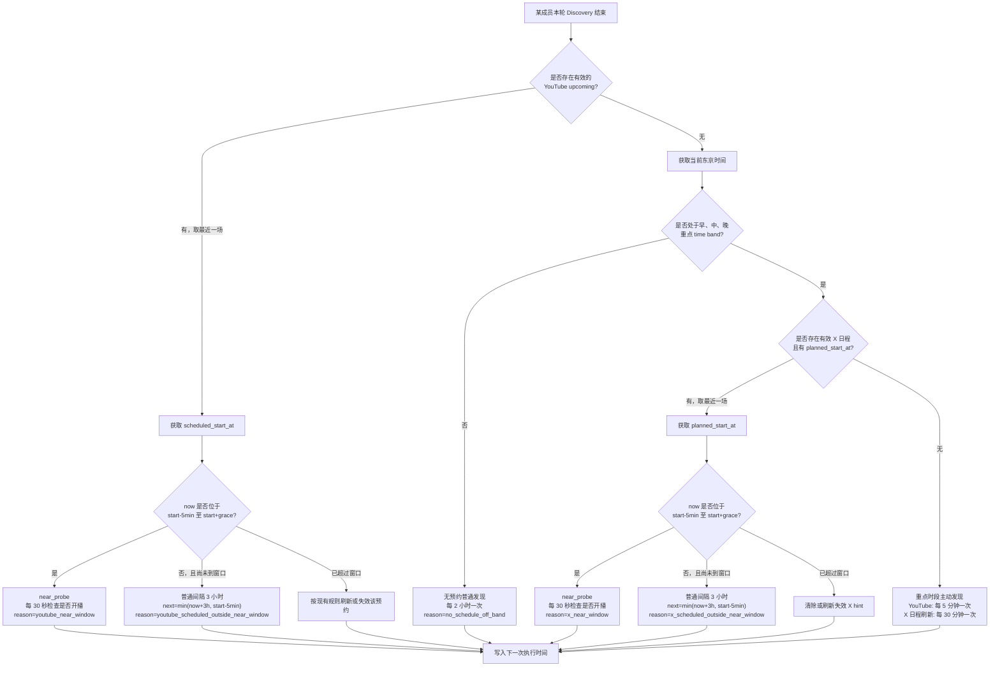

# Discovery 调度逻辑调整说明

## 1. 任务目标

请将当前实现从“最开始 Mermaid 中的全局 profile 调度逻辑”调整为下述新逻辑。

本次修改的核心不是简单调整几个 interval，而是**改变决策顺序**：

1. 先判断该成员是否已经有明确的 YouTube 预约。
2. 有预约时，直接围绕该预约时间调度，不再先套用早、中、晚 time band。
3. 只有在没有有效 YouTube 预约时，才根据东京时间判断当前是否处于早、中、晚重点发现时段。
4. 在重点时段内，再使用 X 日程辅助发现临时直播。
5. 已知预约时允许低频检查；完全没有预约时反而需要更积极地发现直播。

---

## 2. 必须删除或改写的旧逻辑

旧 Mermaid 的入口逻辑是：

```text
schedule_enabled
    ↓
先根据东京时间选择 profile
    ↓
再检查 YouTube upcoming / X hint
```

请改为：

```text
先检查该成员是否有有效 YouTube 预约
    ↓
有预约：围绕预约时间调度
无预约：再根据东京时间和 X 日程调度
```

因此，不要再让 `evening_peak / morning / midday / off_peak` profile 无条件作用于所有成员。

time band 只用于：

```text
当前成员没有有效 YouTube 预约
```

时的主动发现逻辑。

---

## 3. 已确认的业务规则

### 3.1 已有预约时可以低频检查

这是有意设计，不是 interval 写反。

- 已有明确预约、但尚未进入近开播窗口：
  - 普通频率：`3 小时/次`
- 没有预约、且不在重点时间段：
  - 普通频率：`2 小时/次`

设计意图是：

> 已有预约时，开播时间已经明确，不需要频繁主动发现；没有预约时，反而需要更积极地检查是否出现临时直播。

---

### 3.2 不再用“预约是否在今日内”作为核心判断

删除类似以下判断：

```text
scheduled_start_at 是否属于东京时间的今天
```

原因是它会错误处理：

- 23:58 检查次日 00:03 的预约；
- 当前时间与预约时间很接近，但跨越自然日；
- 虽然同属今日，但预约仍在十几个小时之后的情况。

改为直接计算：

```text
scheduled_start_at - now
```

调度只根据绝对时间差和 near window 判断，不根据“今天/明天”的日历标签判断。

东京时区仍然用于判断早、中、晚 time band，但不要用于替代绝对时间比较。

---

### 3.3 普通 interval 不得跨过近开播窗口

当已经知道预约时间时，不能简单使用：

```python
next_discovery_at = now + 3h
```

必须保证下一次检查不会晚于近开播窗口的起点。

设：

```text
pre = 5 分钟
near_window_start = scheduled_start_at - pre
```

当 `now < near_window_start` 时：

```python
next_discovery_at = min(
    now + 3h,
    near_window_start,
)
```

例如：

```text
当前时间：18:00
预约时间：20:00
普通 interval：3 小时
```

不能将下一次检查排到 21:00，应排到 19:55。

---

## 4. 新的完整决策逻辑

### 4.1 第一步：获取最近的有效 YouTube 预约

对当前成员查找 YouTube upcoming。

有效预约至少应满足：

- 存在 `scheduled_start_at`；
- 未取消；
- 未明确结束；
- 仍可作为未来或近期开播候选。

如果有多场 upcoming：

```text
选择 scheduled_start_at 最近的一场有效预约
```

不要因为存在较远的 upcoming 而忽略最近一场。

---

### 4.2 有有效 YouTube 预约

设：

```text
start = scheduled_start_at
pre = 300 秒
grace = 沿用项目当前已有的 post-start grace 配置
near_window = [start - pre, start + grace]
```

#### 当前处于 near window

```text
mode = near_probe
interval = 30 秒
reason = youtube_near_window
```

每 30 秒检查是否已经开播。

#### 当前早于 near window

```text
mode = ordinary
interval = 3 小时
reason = youtube_scheduled_outside_near_window
```

但实际的下一次执行时间必须为：

```python
next_discovery_at = min(
    now + timedelta(hours=3),
    start - timedelta(minutes=5),
)
```

即：3 小时只是最大普通间隔，不能跨过 `start - 5min`。

#### 当前晚于 near window 且仍未开播

沿用项目现有的预约过期/延迟处理方式，不要无限保持 30 秒轮询。

若当前代码没有明确处理，至少需要：

- 在 `start + grace` 后退出 near probe；
- 将该预约标记为过期、待刷新或重新验证；
- 回到无有效预约或普通发现流程；
- 不得永久每 30 秒请求。

---

### 4.3 没有有效 YouTube 预约

此时才查询东京时间是否位于重点 time band。

建议继续使用现有 time band 配置，不要硬编码到业务函数中。当前图示时段为：

```text
morning:       06:00–08:00
midday:        11:45–12:30
evening_peak:  20:00–24:00
```

---

### 4.4 不在任何重点 time band

```text
mode = ordinary
interval = 2 小时
reason = no_schedule_off_band
```

即：

```python
next_discovery_at = now + timedelta(hours=2)
```

注意：这里的 2 小时比“已有预约时的 3 小时”更频繁，这是有意设计。

---

### 4.5 位于重点 time band

在重点时段内查询该成员的 active X hint / X 日程。

X 日程至少需要有：

```text
planned_start_at
```

如果有多个有效 X 日程，取最近的一场。

---

### 4.6 有有效 X 日程

一旦发现有效 X 日程，就将其作为“已知计划时间”处理。

设：

```text
start = planned_start_at
pre = 5 分钟
near_window = [start - pre, start + grace]
```

#### 当前处于 near window

```text
mode = near_probe
interval = 30 秒
reason = x_near_window
```

#### 当前早于 near window

使用“已有明确计划时间”的低频策略：

```text
mode = ordinary
interval = 3 小时
reason = x_scheduled_outside_near_window
```

但下一次执行时间仍必须截断到：

```python
next_discovery_at = min(
    now + timedelta(hours=3),
    start - timedelta(minutes=5),
)
```

不要从发现 X 日程开始就持续每 30 秒查询。

#### X 日程已超过 near window

按照现有 hint 失效规则清除或刷新 X hint，然后重新进入无有效预约流程。

---

### 4.7 重点 time band 内没有有效 X 日程

按用户流程图，本说明将图中的：

```text
30min/次
5min/次
```

解释为两个独立的主动发现频率：

- X 日程刷新：`30 分钟/次`
- YouTube 是否临时开播的 Discovery：`5 分钟/次`

也就是说，在重点时段内，即使没有预约和 X 日程，也需要主动发现无预告直播。

建议不要用一个 interval 同时表达两种不同来源的刷新频率，应分别维护：

```text
next_youtube_discovery_at
next_x_schedule_refresh_at
```

或由同一调度器分别产生两个 due task。

如果当前架构只能保留一个 member discovery interval，则至少：

```text
YouTube Discovery = 5 分钟/次
```

X 日程查询可在该循环中通过独立的 `last_x_refresh_at` 控制为每 30 分钟执行一次。

推荐 reason：

```text
youtube: active_band_unscheduled_probe
x: active_band_x_refresh
```

---

## 5. 推荐伪代码

```python
def decide_member_discovery(member, now):
    youtube_event = get_nearest_valid_youtube_upcoming(member)

    # 1. YouTube 明确预约优先
    if youtube_event is not None:
        return decide_for_known_start(
            now=now,
            start=youtube_event.scheduled_start_at,
            source="youtube",
            ordinary_interval=timedelta(hours=3),
        )

    # 2. 只有无 YouTube 预约时才判断东京 time band
    tokyo_now = to_tokyo_time(now)
    band = match_time_band(tokyo_now)

    # 3. 非重点时段：无预约普通发现
    if band is None:
        return DiscoveryDecision(
            mode="ordinary",
            interval=timedelta(hours=2),
            next_run_at=now + timedelta(hours=2),
            reason="no_schedule_off_band",
        )

    # 4. 重点时段：检查 X 日程
    x_hint = get_nearest_valid_x_hint(member)

    if x_hint is not None and x_hint.planned_start_at is not None:
        return decide_for_known_start(
            now=now,
            start=x_hint.planned_start_at,
            source="x",
            ordinary_interval=timedelta(hours=3),
        )

    # 5. 重点时段内无任何日程：主动发现临时直播
    return DiscoveryDecision(
        mode="active_unscheduled_probe",
        interval=timedelta(minutes=5),
        next_run_at=now + timedelta(minutes=5),
        reason="active_band_unscheduled_probe",
        x_refresh_interval=timedelta(minutes=30),
    )
```

已知开始时间的公共函数：

```python
def decide_for_known_start(
    *,
    now,
    start,
    source,
    ordinary_interval,
):
    pre = timedelta(minutes=5)
    grace = get_configured_grace()
    near_start = start - pre
    near_end = start + grace

    if near_start <= now <= near_end:
        return DiscoveryDecision(
            mode="near_probe",
            interval=timedelta(seconds=30),
            next_run_at=now + timedelta(seconds=30),
            reason=f"{source}_near_window",
        )

    if now < near_start:
        next_run_at = min(
            now + ordinary_interval,
            near_start,
        )
        return DiscoveryDecision(
            mode="ordinary",
            interval=ordinary_interval,
            next_run_at=next_run_at,
            reason=f"{source}_scheduled_outside_near_window",
        )

    return handle_expired_or_delayed_schedule(
        source=source,
        start=start,
        now=now,
    )
```

---

## 6. 调整后的 Mermaid



---

## 7. 配置建议

不要把以下值散落在业务代码中，统一放入调度配置：

```yaml
discovery:
  known_schedule_interval_seconds: 10800   # 3h
  no_schedule_off_band_interval_seconds: 7200  # 2h
  active_band_youtube_interval_seconds: 300    # 5min
  active_band_x_refresh_interval_seconds: 1800 # 30min
  near_probe_interval_seconds: 30
  near_probe_pre_seconds: 300
  near_probe_grace_seconds: <沿用当前配置>

  time_bands:
    morning:
      start: "06:00"
      end: "08:00"
    midday:
      start: "11:45"
      end: "12:30"
    evening_peak:
      start: "20:00"
      end: "24:00"
```

如果已有旧配置字段，请优先做兼容映射，不要立即删除导致配置文件无法启动。

---

## 8. reason 字段建议

至少区分以下原因，便于日志和测试：

```text
youtube_near_window
youtube_scheduled_outside_near_window
x_near_window
x_scheduled_outside_near_window
no_schedule_off_band
active_band_unscheduled_probe
active_band_x_refresh
schedule_expired
x_hint_expired
```

不要再统一写成旧逻辑中的：

```text
idle
scheduled_outside_near_window
```

否则无法从日志判断具体走的是 YouTube、X、重点时段还是非重点时段。

---

## 9. 验收测试

### Case 1：有预约，距离很远

```text
now = 10:00
YouTube start = 20:00
```

期望：

```text
ordinary interval = 3h
next = 13:00
```

---

### Case 2：3 小时会跨过 near window

```text
now = 18:00
YouTube start = 20:00
```

期望：

```text
普通 interval 标称为 3h
实际 next = 19:55
```

不能是 21:00。

---

### Case 3：跨自然日但只差 5 分钟

```text
now = 23:58
YouTube start = 次日 00:03
```

期望：

```text
进入 near_probe
interval = 30s
```

不能因为“预约不在今日内”而进入普通频率。

---

### Case 4：无预约，非重点时间段

```text
now = 东京时间 15:00
无 YouTube upcoming
```

期望：

```text
interval = 2h
reason = no_schedule_off_band
```

---

### Case 5：无 YouTube 预约，重点时段，有 X 日程

```text
now = 20:00
X planned_start_at = 21:00
```

期望：

```text
按照已知计划时间处理
next = min(23:00, 20:55) = 20:55
```

---

### Case 6：重点时段，无 YouTube 预约，无 X 日程

期望：

```text
YouTube Discovery 每 5 分钟一次
X 日程刷新每 30 分钟一次
```

---

### Case 7：已有预约与 time band 冲突

```text
now 位于 evening_peak
同时存在 YouTube 预约
```

期望：

```text
直接走 YouTube 预约分支
不再使用 active-band 的 5 分钟主动发现逻辑
```

---

### Case 8：多个预约

```text
upcoming A = 今日 20:00
upcoming B = 明日 19:00
```

期望：

```text
选择 A
```

---

## 10. 非目标

本次不要顺带修改：

- 直播开始后的正式监控逻辑；
- 同接采集频率；
- 成员资料结构；
- X 文本解析模型；
- YouTube API 的事件状态定义；
- 与此次调度无关的重构。

仅修改 Discovery 决策、下一次执行时间计算、相关配置、日志 reason 和测试。

---

## 11. Agent 输出要求

完成后请返回：

1. 修改了哪些文件；
2. 旧决策顺序如何改成了新决策顺序；
3. 各 interval 对应的配置字段；
4. `next_run_at` 如何避免跨过 `start - 5min`；
5. 新增或修改的测试；
6. 是否存在无法从当前代码确认的旧兼容行为；
7. 给出一段实际日志示例，展示：
   - 有预约但距离较远；
   - 即将开播；
   - 无预约且处于重点时段；
   - 无预约且处于非重点时段。
